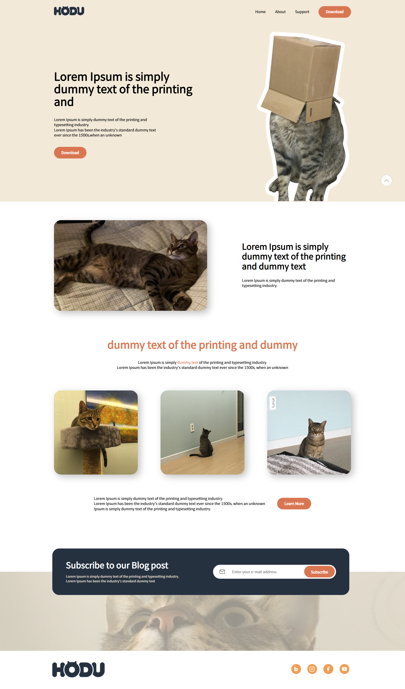
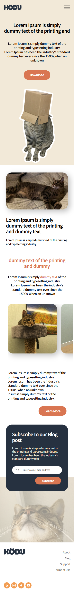

# 🐱 HODU 랜딩 페이지

> 귀여운 고양이 "호두"를 테마로 한 정적 랜딩 페이지입니다.  

---

## 🔗 데모 페이지

👉 [호두 랜딩 페이지 바로가기](https://cheul-95.github.io/estcamp-langding-page/)

---

## 🛠️ 사용 기술

- HTML5 + CSS3 + JS

---

## 📁 프로젝트 구조

```
estcamp-langding-page/
├── css/
│ ├── reset.css # 브라우저 스타일 초기화
│ └── style.css # 페이지 스타일 정의
├── img/ # 모든 이미지 리소스
├── file.pdf # 다운로드용 문서 파일
├── index.html # 메인 HTML 페이지
└── README.md # 프로젝트 설명 문서
```

---

## 🖼️ 미리보기

<table align="center">
  <thead>
    <tr>
      <th align="center">💻 데스크탑 화면</th>
      <th align="center">📱 모바일 화면</th>
    </tr>
  </thead>
  <tbody>
    <tr>
      <td align="center" valign="top">
        
      </td>
      <td align="center" valign="top">
        
      </td>
    </tr>
  </tbody>
</table>

---

## 🔍 시맨틱 마크업 구조 및 특징

<table>
  <thead>
    <tr>
      <th>태그</th>
      <th>적용 예시</th>
      <th>장점</th>
    </tr>
  </thead>
  <tbody>
    <tr>
      <td><code>&lt;header&gt;</code>, <code>&lt;main&gt;</code>, <code>&lt;footer&gt;</code></td>
      <td>페이지 기본 구조 분리</td>
      <td>스크린 리더, SEO 최적화</td>
    </tr>
    <tr>
      <td><code>&lt;section&gt;</code></td>
      <td>banner / content / gallery / subscribe</td>
      <td>정보 블록 논리적 구획</td>
    </tr>
     <tr>
      <td><code>&lt;figure&gt;</code>, <code>&lt;figcaption&gt;</code></td>
      <td>이미지 및 설명 문구를 하나의 의미 단위로 그룹화</td>
      <td>시맨틱 구조 강화, 보조기술(스크린 리더) 지원 향상</td>
    </tr>
    <tr>
      <td><code>&lt;picture&gt;</code>, <code>&lt;source&gt;</code></td>
      <td>반응형 이미지 처리</td>
      <td>다양한 해상도 대응</td>
    </tr>
    <tr>
      <td><code>&lt;clamp&gt;</code></td>
      <td>clamp( 최솟값 , calc((최댓값 / 화면크기) * 100vw),최댓값)</td>
      <td>반응형 폰트 사이즈 대응</td>
    </tr>
    </tbody>
</table>

---

## 📌 주요 특징

✅ HTML + CSS + JS 기반의 웹사이트

✅ 모바일 메뉴 토글 및 다이얼로그(모달) 기능

✅ 반응형 디자인
  - Desktop: max-width: 1320px
  - Tablet: max-width: 1023px
  - Mobile: max-width: 768px
    
✅ 접근성 향상 요소
  - label, aria-label, alt, aria-hidden 등을 적절히 활용

✅ 검색엔진 최적화(SEO)
  - meta 태그: description, keywords, author 설정

✅ CSS 네이밍 방식
  - BEM(Block Element Modifier) 방식 적용
  - 유지보수성과 코드 가독성 개선 

---

📝 구현 중 겪은 인사이트

  Subscribe 영역은 처음에는 **플로팅 배너(Floating Banner)**로 디자인하여 구현을 시도하였으나,
  모바일 반응형 작업 중 실제 의도는 메인 콘텐츠(main 요소) 내부의 하나의 섹션임을 확인하고 구조를 수정하였습니다.
  
  기획 의도에 대한 정확한 이해가 선행되어야 불필요한 리팩토링을 줄일 수 있다는 점을 깨달았고,
  향후 프로젝트에서는 기획안 분석 및 커뮤니케이션의 중요성을 더욱 인식하게 되었습니다.

---

## 📝 피드백 반영 사항

- h1의 img alt값 : 텍스트 이미지이거나 로고와 같이 기업, 브랜드 자체를 표현하는 경우에는 '로고'라는 텍스트는 생략 ( 반영 완료 )
- 동일한 스타일을 사용하고 있어요. 이런 부분은 공통 스타일로 작성 ( 작업 예정 )
- 태블릿 화면 UI 깨지는 부분 중단점 추가하면 좋을것같습니다. ( 반영 완료 ) MOBILE: 767px, TABLET: 1023px,  PC: 1024px
  
---

## 🔧 향후 작업 목록 리스트

 - 모달 닫기 버튼에 추가
 - 두번째 섹션 부터 헤더 고정 시작되도록 개선
 - Open Graph 및 SNS 미리보기용 meta 태그 추가
 - 공통 스타일 작업

---
## 🙋‍♀️ 제작자

- SC LEE  
- GitHub: [@cheul-95](https://github.com/cheul-95)
