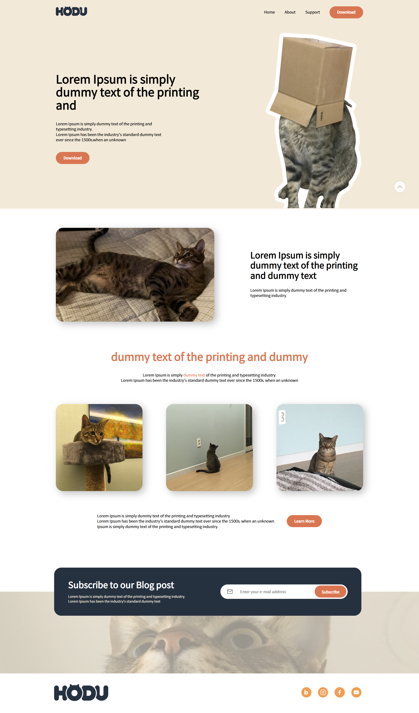

# 🐱 HODU 랜딩 페이지

> 귀여운 고양이 "호두"를 테마로 한 정적 랜딩 페이지입니다.  
> HTML과 CSS만으로 제작되었으며, GitHub Pages를 통해 배포되고 있습니다.

## 🔗 데모 페이지

👉 [호두 랜딩 페이지 바로가기](https://cheul-95.github.io/estcamp-langding-page/)


---

## 🛠️ 사용 기술

- HTML5
- CSS3
- JavaScript (기본 DOM API)

---

## 📁 프로젝트 구조

```
estcamp-langding-page/
├── index.html
├── css/
│   ├── reset.css
│   └── style.css
├── img/              # 이미지 리소스
├── file.pdf          # 다운로드 문서
└── README.md
```

---

## 💻 로컬에서 실행하기

1. 이 저장소를 클론하거나 zip으로 다운로드합니다.
2. `index.html` 파일을 브라우저에서 직접 열면 됩니다.

```
git clone https://github.com/cheul-95/estcamp-langding-page.git
cd estcamp-langding-page
start index.html
```

---

## 📷 미리보기

```markdown
PC 화면

모바일 화면

```
---

## 📌 주요 특징

- ✅ **반응형 디자인** : 모바일/데스크탑 최적화
- ✅ **시맨틱 마크업** 과 접근성 고려
- ✅ **PDF 다운로드** 및 이메일 구독 폼 포함
- ✅ **순수 HTML + CSS + 간단한 JS만 사용** 
- ✅ **모바일 메뉴 토글** 및 **다이얼로그(모달) 기능**
---
## 🙋‍♀️ 제작자

- SC LEE  
- GitHub: [@cheul-95](https://github.com/cheul-95)
